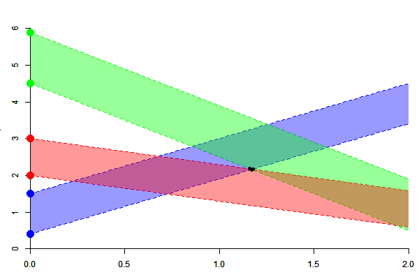

```{r setup, echo=FALSE, cache=FALSE, message=FALSE, warning=FALSE}
extensions <- markdown::markdownExtensions()
options(markdown.extensions=extensions[!is.element(extensions,c("superscript"))])
#options(markdown.extensions=NULL)
#setwd("~/Github/JULIAGFI01"); library(slidify); slidify("index.Rmd")
source("assets/R/slidifyMacros.R")
source('samsung/FiducialR/R/particle_01_functions.R')
library(knitr)
library(animation)
library(scales)
opts_chunk$set(fig.path="assets/fig/JuliaGFI01-")
hook_scianimator <- function (x, options) 
{
    fig.num = options$fig.num
    base = options$fig.path #opts_knit$get("base.url") %n% ""
    id = gsub("[^[:alnum:]]", "_", options$label)
    sprintf("\n<div class=\"scianimator\">\n<div id=\"%s\" style=\"display: inline-block;\">\n</div>\n</div>\n<script type=\"text/javascript\">\n  (function($) {\n    $(document).ready(function() {\n  %s\n    var imgs = Array(%s);\n      for (i=0; ; i++) {\n        if (i == imgs.length) break;\n        imgs[i] = \"%s%s\" + (i + 1) + \".%s\";\n      }\n      $(\"#%s\").scianimator({\n          \"images\": imgs,\n           \"controls\": [\"previous\",  \"next\"],\n \"keyboard\": false,\n \"loopmode\": \"none\",\n \"defaultFrame\": 0\n    });\n     });\n  })(jQuery);\n</script>\n", 
        id, id, fig.num, base, id, 
        options$dev, id)
}
assignInNamespace("hook_scianimator",hook_scianimator, ns="knitr")
opts_knit$set(animation.fun = hook_scianimator)
set.seed(666)
```

## Goal 

- Implement Ciszewski & Hannig's sampler of the fiducial distribution for normal linear mixed models

### Why Julia ?

  - The algorithm is computationnaly intensive
  
  - It requires a high numerical precision; we hope the `BigFloat` type in Julia will achieve this precision 
  
  - Currently, the available Matlab implementation is not sufficient for large datasets

### Why these slides ?

  - I'm not a Julia specialist; these slides should firstly help me to request some help 

  - [Ciszewski & Hannig's paper](http://www.unc.edu/~hannig/publications/CisewskiHannig2012.pdf) is not easy to read for non-mathematicians, and 
  the algorithm may appear complicated to us
  
  - Because I like the [slidify package](http://slidify.org/)

---

## Problem addressed in these slides 

- These slides only address one part of the algorithm: the sampling of 
random polyhedra in the Euclidean space 

- This is the point requiring high numerical precision, because the 
polyhedra are sequentially sampled and become smaller and smaller and smaller...


--- &twocolcustomwidth 

## Polyhedra construction: overview 

*** {name: left, width: "33%"}

- *Data:* Some pairs of points are given on the $y$-axis

- *Sampling:* Some ribbons issued from these points are sampled at random 

- *Computation:* The polyhedron at the intersection of the ribbons

*** {name: right, width: "63%"}

```{r construction_intro, echo=FALSE, cache=FALSE}
# init 
source("./assets/R/sample1.R")
D31["b"] <- D32["b"] <- 0.5 #runif(1,mM[1],mM[2])
part2 <- findVert(part, D31)
part2 <- findVert(part2, D32)
parttemp <- rbind(part,D31,D32)
parttemp[, "include"] <- 1
```


```{r construction_intro_plot00, echo=FALSE, fig.show='animate', cache=FALSE,  fig.height=5}
par(bg = "white")
xlim <- c(0,2)
ylim <- c(0,6.5)
#
plot(0, 0, type="n", xlim=xlim, ylim=ylim, axes=FALSE, 
     xaxs="i", yaxs="i", xlab="x", ylab="y", 
      main="Data")
 axis(1);axis(2)
points(c(0,0), c(D11["a"], D12["a"]), col="blue", pch=19, cex=2, xpd=TRUE)
points(c(0,0), c(D21["a"], D22["a"]), col="green", pch=19, cex=2, xpd=TRUE)
points(c(0,0), c(D31["a"], D32["a"]), col="red", pch=19, cex=2, xpd=TRUE)
# plot.new()
#
plotpart2(parttemp, xlim=xlim, ylim=ylim, lines=TRUE, edges=FALSE, vertices=FALSE, col.line=rep(c("blue","green", "red"),each=2), 
          main="Sampling of ribbons")
points(c(0,0), c(D11["a"], D12["a"]), col="blue", pch=19, cex=2, xpd=TRUE)
points(c(0,0), c(D21["a"], D22["a"]), col="green", pch=19, cex=2, xpd=TRUE)
points(c(0,0), c(D31["a"], D32["a"]), col="red", pch=19, cex=2, xpd=TRUE)
D1 <- D11
D2 <- D12
polygon(x=c(0,0,xlim[2],xlim[2]), y=c(D1["a"], D2["a"], D2["a"]+D2["b"]*xlim[2], D1["a"]+D1["b"]*xlim[2]), col=alpha("blue",0.4), border=NA)
D1 <- D21
D2 <- D22
polygon(x=c(0,0,xlim[2],xlim[2]), y=c(D1["a"], D2["a"], D2["a"]+D2["b"]*xlim[2], D1["a"]+D1["b"]*xlim[2]), col=alpha("green",0.4), border=NA)
D1 <- D31
D2 <- D32
polygon(x=c(0,0,xlim[2],xlim[2]), y=c(D1["a"], D2["a"], D2["a"]+D2["b"]*xlim[2], D1["a"]+D1["b"]*xlim[2]), col=alpha("red",0.4), border=NA)
plot.new()
#
plotpart2(parttemp, xlim=xlim, ylim=ylim, lines=TRUE, edges=FALSE, vertices=FALSE,  col.line=rep(c("blue","green", "red"),each=2), 
          main="Polyhedron")
D1 <- D11
D2 <- D12
polygon(x=c(0,0,xlim[2],xlim[2]), y=c(D1["a"], D2["a"], D2["a"]+D2["b"]*xlim[2], D1["a"]+D1["b"]*xlim[2]), col=alpha("blue",0.4), border=NA)
D1 <- D21
D2 <- D22
polygon(x=c(0,0,xlim[2],xlim[2]), y=c(D1["a"], D2["a"], D2["a"]+D2["b"]*xlim[2], D1["a"]+D1["b"]*xlim[2]), col=alpha("green",0.4), border=NA)
D1 <- D31
D2 <- D32
polygon(x=c(0,0,xlim[2],xlim[2]), y=c(D1["a"], D2["a"], D2["a"]+D2["b"]*xlim[2], D1["a"]+D1["b"]*xlim[2]), col=alpha("red",0.4), border=NA)
plotpart2(part2, lines=FALSE, add=TRUE, col.edge="black")
points(c(0,0), c(D11["a"], D12["a"]), col="blue", pch=19, cex=2, xpd=TRUE)
points(c(0,0), c(D21["a"], D22["a"]), col="green", pch=19, cex=2, xpd=TRUE)
points(c(0,0), c(D31["a"], D32["a"]), col="red", pch=19, cex=2, xpd=TRUE)
```


--- &twocolcustomwidth 

## Polyhedra construction: algorithm 

*** {name: left, width: "33%"}

- *Step 1:* the slopes of the first two pairs of lines are sampled without restriction

- *Step 2:* the polyhedron is computed

- *Step 3:* the slope of the next pair is sampled in a constrained range, assuring there's an intersection

- *Step 4*: the polyhedron is  updated

- *Repeat* steps 3 and 4

*** {name: right, width: "63%"}


```{r construction_intro_plot01, echo=FALSE, fig.show='animate', cache=FALSE,  fig.height=5, interval=.2}
par(bg = "white")
xlim <- c(0,2)
ylim <- c(0,6.5)
# #
# plot(0, 0, type="n", xlim=xlim, ylim=ylim, axes=FALSE, 
#      xaxs="i", yaxs="i", xlab="x", ylab="y", 
#       main="Data")
#  axis(1);axis(2)
# points(c(0,0), c(D11["a"], D12["a"]), col="blue", pch=19, cex=2, xpd=TRUE)
# points(c(0,0), c(D21["a"], D22["a"]), col="green", pch=19, cex=2, xpd=TRUE)
# # plot.new()
# #
# plotpart2(part[part[,"pair"]==1,], xlim=xlim, ylim=ylim, lines=TRUE, edges=FALSE, vertices=FALSE, 
#           main="Step1:")
# points(c(0,0), c(D11["a"], D12["a"]), col="blue", pch=19, cex=2, xpd=TRUE)
# points(c(0,0), c(D21["a"], D22["a"]), col="green", pch=19, cex=2, xpd=TRUE)
# plot.new()
# #
# plotpart2(part, xlim=xlim, ylim=ylim, lines=TRUE, edges=FALSE, vertices=FALSE, 
#           main="Step2:")
# points(c(0,0), c(D11["a"], D12["a"]), col="blue", pch=19, cex=2, xpd=TRUE)
# points(c(0,0), c(D21["a"], D22["a"]), col="green", pch=19, cex=2, xpd=TRUE)
# plot.new()
#
plotpart2(part, xlim=xlim, ylim=ylim, lines=TRUE, edges=FALSE, vertices=FALSE, 
          col.line=rep(c("blue","green"),each=2, col.edge="black"),
          main="Step 1:")
points(c(0,0), c(D11["a"], D12["a"]), col="blue", pch=19, cex=2, xpd=TRUE)
points(c(0,0), c(D21["a"], D22["a"]), col="green", pch=19, cex=2, xpd=TRUE)
#
plotpart2(part, xlim=xlim, ylim=ylim, lines=TRUE, 
          col.line=rep(c("blue","green"),each=2), col.edge="black",
          main="Step 2:")
points(c(0,0), c(D11["a"], D12["a"]), col="blue", pch=19, cex=2, xpd=TRUE)
points(c(0,0), c(D21["a"], D22["a"]), col="green", pch=19, cex=2, xpd=TRUE)
#
plotpart2(parttemp, xlim=xlim, ylim=ylim, lines=TRUE, edges=FALSE, vertices=FALSE,  col.line=rep(c("blue","green", "red"),each=2), 
          main="Step 3")
plotpart2(part, lines=FALSE, add=TRUE, col.edge="black")
points(c(0,0), c(D11["a"], D12["a"]), col="blue", pch=19, cex=2, xpd=TRUE)
points(c(0,0), c(D21["a"], D22["a"]), col="green", pch=19, cex=2, xpd=TRUE)
points(c(0,0), c(D31["a"], D32["a"]), col="red", pch=19, cex=2, xpd=TRUE)
#
plotpart2(parttemp, xlim=xlim, ylim=ylim, lines=TRUE, edges=FALSE, vertices=FALSE,  col.line=rep(c("blue","green", "red"),each=2), 
          main="Step 4")
plotpart2(part2, lines=FALSE, add=TRUE, col.edge="black" )
points(c(0,0), c(D11["a"], D12["a"]), col="blue", pch=19, cex=2, xpd=TRUE)
points(c(0,0), c(D21["a"], D22["a"]), col="green", pch=19, cex=2, xpd=TRUE)
points(c(0,0), c(D31["a"], D32["a"]), col="red", pch=19, cex=2, xpd=TRUE)
```


--- &twocolcustomwidth

## Line and polyhedron representation 

  - A line has a ''type'': upper or lower
  
  - A line has $0$, $1$ or $2$ intersections with the active polyhedron

*** {name: left, width: "60%"}

```{r line_plot01, echo=FALSE, fig.show='animate', cache=FALSE,  fig.height=5}
par(bg = "white")
plot0 <- function(){
  par(mar=c(1,1,0.1,1))
  plotpart2(part, xlim=xlim, ylim=ylim, lines=TRUE, 
          col.line=rep(c("blue","green"),each=2), col.edge="black",
          main="", xlab=NA, ylab=NA)
points(c(0,0), c(D11["a"], D12["a"]), col="blue", pch=19, cex=2, xpd=TRUE)
points(c(0,0), c(D21["a"], D22["a"]), col="green", pch=19, cex=2, xpd=TRUE)
}
plot0()
plot.new()
# 
plot0()
points(0, 1, col="red", pch=19, cex=2, xpd=TRUE)
abline(a=1, b=2.8, col="red", lwd=2)
plot.new()
# 
plot0()
points(0, 1, col="red", pch=19, cex=2, xpd=TRUE)
abline(a=1, b=0.96, col="red", lwd=2)
plot.new()
# 
plot0()
points(0, 1, col="red", pch=19, cex=2, xpd=TRUE)
abline(a=1, b=1.4, col="red", lwd=2)
```

*** {name: right, width: "40%"}

`r linebreak("30pt")`

- Only lines having two intersections are kept

- A polyhedron is represented by its set of vertices, but it is more convienently handled by ordering its vertices


--- &twocolcustomwidth

## Line and polyhedron in Julia  

*** {name: left, width: "50%"}

I will use these types to handle lines and ribbons:

```{r type_line, results='asis', echo=FALSE}
codechunk(file="type_Line.jl", size="67%")
```


The intercepts are  provided as data by the user, hence they are `Float64`. 
The slopes are generated by the algorithm and are treated as `BigFloat`. 


*** {name: right, width: "46%"}

A polyhedron (or *particle*) will be treated as a `BigFloat` array, and the 
following function is used to order the vertices:

```{r julia_orderpart, results='asis', echo=FALSE}
codechunk(file="function_orderPart.jl", size="67%")
```


--- &twocolcustomwidth

## The first particle 


In reality the first particle is sampled at random, but we define a fixed 
particle for illustration.

*** {name: left, width: "49%"}

```{r julia_DlowDupp, results='asis', echo=FALSE, cache=FALSE}
codechunk(file="function_DlowDupp.jl", size="68%")
```

```{r julia_intersect, results='asis', echo=FALSE, cache=FALSE}
codechunk(file="function_intersect.jl", size="68%")
```

*** {name: right, width: "51%"}

```{r julia_firstP, results='asis', echo=FALSE, cache=FALSE}
codechunk('# first ribbon: 
R1 = Ribbon(0.4, 1.5, BigFloat("1.5"));
D1_low = Dlow(R1);
D1_upp = Dupp(R1);
# second ribbon:
R2 = Ribbon(4.5, 5.9, BigFloat("-2"));
D2_low = Dlow(R2);
D2_upp = Dupp(R2);

# find the intersections:
A = intersect((D1_low.a, D1_low.b), (D2_low.a, D2_low.b));
B = intersect((D1_low.a, D1_low.b), (D2_upp.a, D2_upp.b));
C = intersect((D1_upp.a, D1_upp.b), (D2_low.a, D2_low.b));
D = intersect((D1_upp.a, D1_upp.b), (D2_upp.a, D2_upp.b));

# particle:
poly = orderPart(hcat(A,B,C,D))', size="68%")
```


--- &twocolcustomwidth

## Plotting a Javascript particle with [Gadfly](https://github.com/dcjones/Gadfly.jl)

```{r julia_fplotPart, results='asis', echo=FALSE, cache=FALSE}
codechunk('using Gadfly
function plotPart(poly::Array{BigFloat,2})
        poly = orderPart(poly)
        x = float64(poly[1,[1:size(poly,2);1]])
        y = float64(poly[2,[1:size(poly,2);1]])
        p = plot(x = x, y = y, Geom.point, Geom.line(preserve_order=true))
        return p
end', size="66%")
```


*** {name: left, width: "34%"}

`r linebreak("0pt")`

```{r julia_plotPart, results='asis', echo=FALSE, cache=FALSE}
codechunk('p = plotPart(poly)
draw(D3("part01.js", 630px, 340px), p)', size="66%")
```

`r linebreak("2pt")`

*Don't forget to play with this graphic !* 
(zoom in/out and move it by maintaining the click of the mouse)


*** {name: right, width: "64%"}


<!-- Placed whereever you want the graphic to be rendered. -->
<iframe src="assets/img/part01.html" style="border: none; "></iframe>


--- 

## Computing the range and intersection 

Recall the two steps, when a particle and a new pair of starting points 
on the $y$-axis is given:

- Calculate the range of the possible slope of the new ribbon

- Generate the new ribbon and compute the new particle


```{r init_newribbon, echo=FALSE, cache=FALSE}
# init 
source("./assets/R/sample1.R")
seq.b <- seq(mM[1]*0.98, mM[2]*0.98, len=80)
```

```{r gif, echo=FALSE, message=FALSE, cache=FALSE}
if(!file.exists("./assets/img/range.gif")){
  saveGIF({
    for(b in c(seq.b, rev(seq.b))){
      D31["b"] <- D32["b"] <- b #runif(1,mM[1],mM[2])
      part2 <- findVert(part, D31)
      part2 <- findVert(part2, D32)
      parttemp <- rbind(part,D31,D32)
      parttemp[, "include"] <- 1
      par(bg = "white")
      xlim <- c(0,2)
      ylim <- c(0,6.5)
      #
      par(mar=c(3,3,1,1))
      plotpart2(parttemp, xlim=xlim, ylim=ylim, lines=TRUE, edges=FALSE, vertices=FALSE,  col.line=rep(c("blue","green", "red"),each=2), 
                main=NA)
      D1 <- D11
      D2 <- D12
      polygon(x=c(0,0,xlim[2],xlim[2]), y=c(D1["a"], D2["a"], D2["a"]+D2["b"]*xlim[2], D1["a"]+D1["b"]*xlim[2]), col=alpha("blue",0.4), border=NA)
      D1 <- D21
      D2 <- D22
      polygon(x=c(0,0,xlim[2],xlim[2]), y=c(D1["a"], D2["a"], D2["a"]+D2["b"]*xlim[2], D1["a"]+D1["b"]*xlim[2]), col=alpha("green",0.4), border=NA)
      D1 <- D31
      D2 <- D32
      polygon(x=c(0,0,xlim[2],xlim[2]), y=c(D1["a"], D2["a"], D2["a"]+D2["b"]*xlim[2], D1["a"]+D1["b"]*xlim[2]), col=alpha("red",0.4), border=NA)      
      plotpart2(part2, lines=FALSE, add=TRUE, col.edge="black")
      points(c(0,0), c(D11["a"], D12["a"]), col="blue", pch=19, cex=2, xpd=TRUE)
      points(c(0,0), c(D21["a"], D22["a"]), col="green", pch=19, cex=2, xpd=TRUE)
      points(c(0,0), c(D31["a"], D32["a"]), col="red", pch=19, cex=2, xpd=TRUE)
      }
    }, movie.name = "range.gif", interval = 0.06, nmax = 30, ani.width = 600, 
    ani.height = 400, outdir=paste0(getwd(),"/assets/img"), autobrowse=FALSE)
  }
```

```{r showgif1, results='asis', echo=FALSE}
cat('')
```


--- 

## Computing the range

Two different situations are distinguished for the range calculation:

```{r twosituations, echo=FALSE,  fig.width=13, fig.height=4, cache=FALSE}
layout(t(c(1,2)))
par(mar=c(5,3,1,1))
plotpart2(part, xlim=xlim, ylim=ylim,  edges=TRUE, vertices=TRUE, lines=FALSE,
          col.edge="black", col.line=rep(c("blue","green"),each=2), main=NA, 
          xlab=NA, ylab=NA, 
          sub=expression(italic("the y-axis doesn't cross the particle")), cex.sub=2)
#       D1 <- D11
#       D2 <- D12
#       polygon(x=c(0,0,xlim[2],xlim[2]), y=c(D1["a"], D2["a"], D2["a"]+D2["b"]*xlim[2], D1["a"]+D1["b"]*xlim[2]), col=alpha("blue",0.4), border=NA)
#       D1 <- D21
#       D2 <- D22
#       polygon(x=c(0,0,xlim[2],xlim[2]), y=c(D1["a"], D2["a"], D2["a"]+D2["b"]*xlim[2], D1["a"]+D1["b"]*xlim[2]), col=alpha("green",0.4), border=NA)
par(mar=c(5,3,1,1))
partemp <- part
partemp[,"x1"] <- part[,"x1"] - 1.37
partemp[,"x2"] <- part[,"x2"] - 1.37
plotpart2(partemp, xlim=c(-1,1), ylim=ylim,  edges=TRUE, vertices=TRUE, lines=FALSE,
          col.edge="black", col.line=rep(c("blue","green"),each=2), main=NA, 
                    xlab=NA, ylab=NA, 
          sub=expression(italic("the y-axis crosses the particle")), cex.sub=2)
```

The first situation is easier to handle. 
We will restrict to this situation in these slides.


--- &twocolcustomwidth

## The range in the simple situation 

Denote by $P$ the current particle and by 
$\color{red}{\lbrace a^-, a^+\rbrace}$ the new pair of points on the $y$-axis. 
Then the possible range for the slope of the new ribbon is the interval 
$(m,M)$ where 
$$ 
m = \underset{(x,y) \in P}{\min} \left\lbrace\frac{y - a^-}{x}, \frac{y - a^+}{x}\right\rbrace
\quad \text{and} \quad 
M = \max_{(x,y) \in P} \left\lbrace\frac{y - a^-}{x}, \frac{y - a^+}{x}\right\rbrace
$$

*** {name: left, width: "55%"}

```{r julia_range, results='asis', echo=FALSE}
codechunk('function findRange(poly::Array{BigFloat,2}, lower::Float64, 
            upper::Float64)
        if ( (minimum(poly[1,:]) > 0) || (maximum(poly[1,:])<0) )
            slopes = [(poly[2,:]-lower)./poly[1,:] (poly[2,:]-upper)./poly[1,:]]
            return [ minimum(slopes) ; maximum(slopes) ]
        else # the y-axis cuts the paricle
            .... not shown in theses slides ', size="69%")
```

`r linebreak("10pt")`

It remains to write a function calculating the new particle once the new ribbon 
is sampled.

*** {name: right, width: "45%"}

```{r showgif2, results='asis', echo=FALSE}
cat('')
```


--- &twocolcustomwidth

## The intersection (1/6)

*** {name: left, width: "50%"}

```{r julia_newribbon_01, results='asis', echo=FALSE}
codechunk('# new ribbon
a_low = 2.;
a_upp = 3.;
b = BigFloat("0.5");
R3 = Ribbon(a_low, a_upp, b)', 
size="71%")
```

```{r plot_newribbon_01, echo=FALSE,  cache=FALSE,  fig.height=4.3}
par(bg = "white")
source("./assets/R/sample1.R")
D31["b"] <- D32["b"] <- 0.5
      D31["b"] <- D32["b"] <- 0.5 
      part2 <- findVert(part, D31)
      part2 <- findVert(part2, D32)
      parttemp <- rbind(part,D31,D32)
      parttemp[, "include"] <- 1
      par(bg = "white")
      xlim <- c(0,2)
      ylim <- c(0,6.5)
      #
      par(mar=c(3,3,1,1))
      plotpart2(parttemp, xlim=xlim, ylim=ylim, lines=TRUE, edges=FALSE, vertices=FALSE,  col.line=rep(c("blue","green", "red"),each=2), 
                main=NA)
      D1 <- part[1,]
      D2 <- part[2,]
      polygon(x=c(0,0,xlim[2],xlim[2]), y=c(D1["a"], D2["a"], D2["a"]+D2["b"]*xlim[2], D1["a"]+D1["b"]*xlim[2]), col=alpha("blue",0.4), border=NA)
      text(x=mean(D1[c("x1","x2")]), y= mean(D1[c("y1","y2")]), 
           labels="1", pos=1, cex=1)
      text(x=mean(D2[c("x1","x2")]), y= mean(D2[c("y1","y2")]), 
           labels="3", pos=3, cex=1)
      D1 <- part[3,]
      D2 <- part[4,]
      polygon(x=c(0,0,xlim[2],xlim[2]), y=c(D1["a"], D2["a"], D2["a"]+D2["b"]*xlim[2], D1["a"]+D1["b"]*xlim[2]), col=alpha("green",0.4), border=NA)
      text(x=mean(D1[c("x1","x2")]), y= mean(D1[c("y1","y2")]), 
           labels="4", pos=1, cex=1)
      text(x=mean(D2[c("x1","x2")]), y= mean(D2[c("y1","y2")]), 
           labels="2", pos=3, cex=1)
      D1 <- D31
      D2 <- D32
      polygon(x=c(0,0,xlim[2],xlim[2]), y=c(D1["a"], D2["a"], D2["a"]+D2["b"]*xlim[2], D1["a"]+D1["b"]*xlim[2]), col=alpha("red",0.4), border=NA)
      plotpart2(part2, lines=FALSE, add=TRUE, col.edge="black")
      points(c(0,0), c(D11["a"], D12["a"]), col="blue", pch=19, cex=2, xpd=TRUE)
      points(c(0,0), c(D21["a"], D22["a"]), col="green", pch=19, cex=2, xpd=TRUE)
      points(c(0,0), c(D31["a"], D32["a"]), col="red", pch=19, cex=2, xpd=TRUE)
```

*** {name: right, width: "50%"}

For each edge ($1$, $2$, $3$, $4$) of the current particle, here are the number of 
vertices above the lower new line:

  
```{r julia_test12, results='asis', echo=FALSE}
codechunk("D = Dlow(R3)
test1 = vec(poly[2,:]) .> D.a .+ D.b .* vec(poly[1,:])
test2 = test1[[2:size(opoly)[2]; 1]]
test = test1 + test2", size="68%")
```

```{r julia_test12_out, results='asis', echo=FALSE}
codechunk("julia> test
4-element Array{Int64,1}:
 0
 1
 2
 1", size="68%")
```


--- &twocolcustomwidth

## The intersection (2/6)

*** {name: left, width: "47%"}

Given these results:

```{r julia_test12_out_copy, ref.label='julia_test12_out', results='asis', echo=FALSE}
```

```{r plot_newribbon_01_copy, ref.label='plot_newribbon_01', echo=FALSE, cache=FALSE, fig.height=4.3}
```


*** {name: right, width: "50%"}

$\implies$ we know that:

  - The first edge has to be removed

  - For the third edge, there's nothing to do. 
  
  - For the second and fourth edges, we calculate the intersection.
  

```{r julia_xx, results='asis', echo=FALSE}
codechunk("julia> Dinters = find(test.== 1) # should be 0 or 2 elements
2-element Array{Int64,1}:
 2
 4", size="71%")
```


--- &twocolcustomwidth

## The intersection (3/6)

*** {name: left, width: "49%"}

There are four situations for the intersection: 

```{r foursituations, echo=FALSE, fig.show='animate', cache=FALSE,  fig.height=5}
par(bg = "white")
seq.b <- c(0, 0.3, 0.6, 0.95)
seq.main <- paste0("Case: ", c("Nothing to do", "One vertex outside", "Two vertices outside", "More than two outside" ))
for(i in 1:4){
        D31["b"] <- seq.b[i]
      part2 <- findVert(part, D31)
      parttemp <- rbind(part,D31)
      parttemp[, "include"] <- 1
      par(bg = "white")
      xlim <- c(0,2)
      ylim <- c(0,6.5)
      #
      par(mar=c(3,3,3,1))
      plotpart2(parttemp, xlim=xlim, ylim=ylim, lines=TRUE, edges=FALSE, vertices=FALSE,  col.line=rep(c("blue","green", "red"),each=2), 
                main=seq.main[i], cex.main=1.5)
      D1 <- D11
      D2 <- D12
      polygon(x=c(0,0,xlim[2],xlim[2]), y=c(D1["a"], D2["a"], D2["a"]+D2["b"]*xlim[2], D1["a"]+D1["b"]*xlim[2]), col=alpha("blue",0.4), border=NA)
      D1 <- D21
      D2 <- D22
      polygon(x=c(0,0,xlim[2],xlim[2]), y=c(D1["a"], D2["a"], D2["a"]+D2["b"]*xlim[2], D1["a"]+D1["b"]*xlim[2]), col=alpha("green",0.4), border=NA)
      D1 <- D31
      polygon(x=c(0,0,xlim[2],xlim[2]), y=c(D1["a"], 100, 100, D1["a"]+D1["b"]*xlim[2]), col=alpha("red",0.4), border=NA)
      
      plotpart2(part2, lines=FALSE, add=TRUE, col.edge="black")
      points(c(0,0), c(D11["a"], D12["a"]), col="blue", pch=19, cex=2, xpd=TRUE)
      points(c(0,0), c(D21["a"], D22["a"]), col="green", pch=19, cex=2, xpd=TRUE)
      points(c(0), c(D31["a"]), col="red", pch=19, cex=2, xpd=TRUE)
}
```


*** {name: right, width: "49%"}

  - `updatePoly1()` handles the case of two points (one edge) outside
  - `updatePoly2()` handles the case of one point outside 
  - `updatePoly()` handles the general case: 
    - it determines the situation
    - it runs `updatePoly1()` or `updatePoly2()` in case 1 or 2 
    - deletes some vertices and runs `updatePoly1()` in case of $>2$ points outside 


--- &twocolcustomwidth

## The intersection (4/6)

*** {name: left, width: "41%"}

We  use the following function to get the $i$-th edge of the ordered 
particle:

```{r macro_getline, results='asis', echo=FALSE}
codechunk('# converts an edge to (intercept, slope)
function getLine(poly::Array{BigFloat,2}, index::Int)
        A = poly[:,index]
  	    B = poly[:,rem1(index+1,size(poly,2))]
        slope = (B[2]-A[2])/(B[1]-A[1])
        intercept = A[2] - slope*A[1]
        return (intercept, slope)
end', size="64%")
```


*** {name: right, width: "56%"}

*Intersection in case of two points (one edge) outside:*

```{r julia_updatePoly1, results='asis', echo=FALSE}
codechunk('function updatePoly1(opoly::Array{BigFloat,2}, D::Line, toRemove::Int)
        # first edge
        index = if toRemove==1 size(opoly)[2] else toRemove-1 end
        M = intersect((D.a,D.b), getLine(opoly,index))
        # second edge
        index = if toRemove==size(opoly)[2] 1 else toRemove+1 end
        N = intersect((D.a,D.b), getLine(opoly,index))
        #
        opoly[:,toRemove] = M
        opoly[:,index] = N
        #
        return opoly
end', size="64%")
```


--- &twocolcustomwidth

## The intersection (5/6)

*** {name: left, width: "79%"}

*Intersection in case of one point outside:*

```{r julia_updatePoly2, results='asis', echo=FALSE}
codechunk('function updatePoly2(opoly::Array{BigFloat,2}, D::Line, Dinters::Array{Int64,1}, test1::BitArray{1})
    # shift to put the two edges at first positions
    ncol = size(opoly)[2]
    if Dinters[2]-Dinters[1] != 1
            arrange = [ncol, [1:ncol-1]]
    else
            arrange = [rem1(i+Dinters[1]-1,ncol)::Int for i=1:ncol]  
    end
    opoly = opoly[:, arrange]
    # intersections
    M = intersect((D.a,D.b), getLine(opoly,1))
    N = intersect((D.a,D.b), getLine(opoly,2))
    #
    test = test1[arrange][2]
    if( (!D.typ && !test) || (D.typ && test) )
        return hcat(opoly[:,1], M, N, opoly[:, [3:ncol]])
    else
        return hcat(M, opoly[:,2], N)
    end
end', size="68%")
```

*** {name: right, width: "49%"}


--- &twocolcustomwidth

## The intersection (6/6) - main function


*** {name: left, width: "60%"}

```{r julia_uupdatePoly, results='asis', echo=FALSE}
codechunk('function updatePoly(opoly::Array{BigFloat,2}, D::Line)
            test1 = vec(opoly[2,:]) .> D.a .+ D.b .* vec(opoly[1,:])
            test2 = test1[[2:size(opoly)[2]; 1]]
            test = test1 + test2
            if(D.typ==false)
                Remove = test .== 0
            else
                Remove = test .== 2
            end
            toRemove = find(Remove)
            if length(toRemove) == 1
                    return updatePoly1(opoly, D, toRemove[1])
            elseif length(toRemove) == 0
                    Dinters=find(test.== 1)
                    if length(Dinters) == 2
                        return updatePoly2(opoly, D, Dinters, test1)
                    else
                        return opoly
                    end
            else
                    if Remove[1] && last(Remove)
                        indices = find(!Remove)
                        torem =  size(indices)[1]+1
                        indices = [indices, last(indices)+1]
                    else
                        indices = [1:size(opoly)[2]]
                        indices = deleteat!(indices, toRemove[2]:last(toRemove))
                        torem = toRemove[1]
                    end
                    return updatePoly1(opoly[:,indices], D, torem)
            end
end', size="56%")
```

*** {name: right, width: "39%"}

`updatePoly()` takes an ordered particle and returns an ordered particle - thus we only have to apply `orderPart()` to the initial particle

--- &twocolcustomwidth

## to continue...

*** {name: left, width: "49%"}

*** {name: right, width: "49%"}

```{r julia_xxxxxxxxxxx, results='asis', echo=FALSE}
codechunk(' ', size="68%")
```


