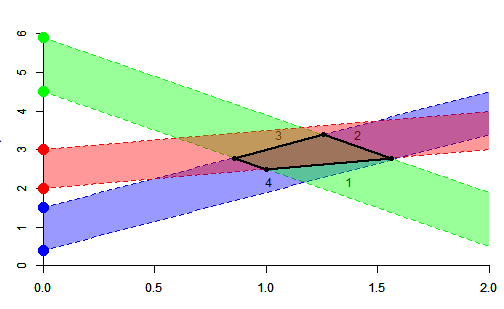

## Goal 

- Implement Ciszewski & Hannig's sampler of the fiducial distribution for normal linear mixed models

### Why Julia ?

  - The algorithm is computationnaly intensive
  
  - It requires a high numerical precision; we hope the `BigFloat` type in Julia will achieve this precision 
  
  - Currently, the available Matlab implementation is not sufficient for large datasets

### Why these slides ?

  - I'm not a Julia specialist; these slides should firstly help me to request some help 

  - [Ciszewski & Hannig's paper](http://www.unc.edu/~hannig/publications/CisewskiHannig2012.pdf) is not easy to read for non-mathematicians, and 
  the algorithm may appear complicated to us
  
  - Because I like the [slidify package](http://slidify.org/)

---

## Problem addressed in these slides 

- These slides only address one part of the algorithm: the sampling of 
random polyhedra in the Euclidean space 

- This is the point requiring high numerical precision, because the 
polyhedra are sequentially sampled and become smaller and smaller and smaller...

--- &twocolcustomwidth 

## Polyhedra construction: overview 

*** {name: left, width: "33%"}

- *Data:* Some pairs of points are given on the $y$-axis

- *Sampling:* Some ribbons issued from these points are sampled at random 

- *Computation:* The polyhedron at the intersection of the ribbons

*** {name: right, width: "63%"}

--- &twocolcustomwidth 

## Polyhedra construction: algorithm 

*** {name: left, width: "33%"}

- *Step 1:* the slopes of the first two pairs of lines are sampled without restriction

- *Step 2:* the polyhedron is computed

- *Step 3:* the slope of the next pair is sampled in a constrained range, assuring there's an intersection

- *Step 4*: the polyhedron is  updated

- *Repeat* steps 3 and 4

*** {name: right, width: "63%"}

--- &twocolcustomwidth

## Line and polyhedron representation 

  - A line has a ''type'': upper or lower
  
  - A line has $0$, $1$ or $2$ intersections with the active polyhedron

*** {name: left, width: "60%"}

*** {name: right, width: "40%"}

- Only lines having two intersections are kept

- A polyhedron is represented by its set of vertices

--- &twocolcustomwidth

## Line and polyhedron in Julia  

*** {name: left, width: "50%"}

I will use this type and this function to define a line from an intercept and a slope:

<pre><code class="r" style="font-size:67%">type Line
        a::Float64   # intercept
        b::BigFloat  # slope
        typ::Bool    # type of the line (true:upper, false:lower)
end
</code></pre>

<pre><code class="r" style="font-size:67%"># generates a new line with given intercept and slope
function newLine(a::Float64, b::BigFloat, typ::Bool)
        return Line(a, b, typ)
end
</code></pre>

The intercepts are  provided as data by the user, hence they are `Float64`. 
The slopes are generated by the algorithm and are treated as `BigFloat`. 

*** {name: right, width: "46%"}

A polyhedron (or *particle*) will be treated as a `BigFloat` array, and the 
following function will be used in the algorithm to order the lines of a particle. 
It will also be used in `plotPart` function as well (see later):

<pre><code class="r" style="font-size:67%"># order poly
function orderPart(poly::Array{BigFloat,2})
        # compute an interior point
        O = [ mean(poly[1,1:3]) , mean(poly[2,1:3]) ]
        # center the polyhedron around O
        cpoly = poly .- O
        # compute the angular parts of polar coordinates
        angles = atan2(cpoly[2,:], cpoly[1,:])
        # find the order
        ord  = sortperm(vec(angles))
        return poly[:,ord]
end
</code></pre>

--- &twocolcustomwidth

## The first particle 

In reality the first particle is sampled at random, but we define a fixed 
particle for illustration.

*** {name: left, width: "49%"}

<pre><code class="r" style="font-size:68%"># generates a new line with given intercept and slope
function newLine(a::Float64, b::BigFloat, typ::Bool)
        return Line(a, b, typ)
end
</code></pre>

<pre><code class="r" style="font-size:68%"># returns the intersection of two lines given by (intercept, slope)
function intersect(D1, D2)
        x = (D1[1]-D2[1])/(D2[2]-D1[2])
        return [x, D1[1] + D1[2]*x]
end
</code></pre>

*** {name: right, width: "51%"}

<pre><code class="r" style="font-size:68%"># first ribbon: 
D1_low = newLine(0.4, BigFloat("1.5"), false);
D1_upp = newLine(1.5, BigFloat("1.5"), true);
# second ribbon:
D2_low = newLine(4.5, BigFloat("-2"), false);
D2_upp = newLine(5.9, BigFloat("-2"), true);

# find the intersections:
A = intersect((D1_low.a, D1_low.b), (D2_low.a, D2_low.b));
B = intersect((D1_low.a, D1_low.b), (D2_upp.a, D2_upp.b));
C = intersect((D1_upp.a, D1_upp.b), (D2_low.a, D2_low.b));
D = intersect((D1_upp.a, D1_upp.b), (D2_upp.a, D2_upp.b));

# particle:
poly = hcat(A,B,C,D)
</code></pre>

--- &twocolcustomwidth

## Plotting a Javascript particle with [Gadfly](https://github.com/dcjones/Gadfly.jl)

<pre><code class="r" style="font-size:66%">using Gadfly
function plotPart(poly::Array{BigFloat,2})
        poly = orderPart(poly)
        x = float64(poly[1,[1:size(poly,2);1]])
        y = float64(poly[2,[1:size(poly,2);1]])
        p = plot(x = x, y = y, Geom.point, Geom.line(preserve_order=true))
        return p
end
</code></pre>

*** {name: left, width: "34%"}

<pre><code class="r" style="font-size:66%">p = plotPart(poly)
draw(D3("part01.js", 630px, 340px), p)
</code></pre>

*Don't forget to play with this graphic !* 
(zoom in/out and move it by maintaining the click of the mouse)

*** {name: right, width: "64%"}

<!-- Placed whereever you want the graphic to be rendered. -->
<iframe src="assets/img/part01.html" style="border: none; "></iframe>

--- 

## Computing the range and intersection 

Recall the two steps, when a particle and a new pair of starting points 
on the $y$-axis is given:

- Calculate the range of the possible slope of the new ribbon

- Generate the new ribbon and compute the new particle

--- 

## Computing the range

Two different situations are distinguished for the range calculation:

 

The first situation is easier to handle. 
We will restrict to this situation in these slides.

--- &twocolcustomwidth

## The range in the simple situation 

Denote by $P$ the current particle and by 
$\color{red}{\{a^-, a^+\}}$ the new pair of points on the $y$-axis. 
Then the possible range for the slope of the new ribbon is the interval 
$(m,M)$ where 
$$ 
m = \min_{(x,y) \in P} \left\{\frac{y - a^-}{x}, \frac{y - a^+}{x}\right\}
\quad \text{and} \quad 
M = \max_{(x,y) \in P} \left\{\frac{y - a^-}{x}, \frac{y - a^+}{x}\right\}
$$

<pre><code class="r" style="font-size:71%"># find the range
function findRange(poly::Array{BigFloat,2}, lower::Float64, upper::Float64)
        slopes = [(poly[2,:]-lower)./poly[1,:] (poly[2,:]-upper)./poly[1,:]]
        return [ minimum(slopes) ; maximum(slopes) ]
end
</code></pre>

*** {name: left, width: "51%"}

*** {name: right, width: "45%"}

It remains to write a function calculating the new particle once the new ribbon 
is sampled

--- &twocolcustomwidth

## The intersection in the simple situation (1/2)

*** {name: left, width: "50%"}

<pre><code class="r" style="font-size:71%"># new ribbon
a_low = 2.;
a_upp = 3.;
println("range:", float64(findRange(poly, a_low, a_upp)))
D3_low = newLine(a_low, BigFloat("0.5"), false);
D3_upp = newLine(a_upp, BigFloat("0.5"), true);
</code></pre>

 

*** {name: right, width: "45%"}

The $i$-th edge of the ordered particle is the segment $[AB]$ with 
$A=(x_1(i), y_1(i))$ and $B=(x_2(i), y_2(i))$.

<pre><code class="r" style="font-size:71%">opoly = orderPart(poly)
x1 = vec(opoly[1,:])
y1 = vec(opoly[2,:])
x2 = x1[[2:length(x1); 1]]
y2 = y1[[2:length(x1); 1]]
</code></pre>

--- &twocolcustomwidth

## The intersection in the simple situation (2/2)

*** {name: left, width: "47%"}

For each edge ($1$, $2$, $3$, $4$) of the current particle, here are the number of 
vertices above the lower new line:

  
<pre><code class="r" style="font-size:71%">D = D3_low
    test1 = y1 .> D.a .+ D.b .* x1
    test2 = y2 .> D.a .+ D.b .* x2
    test = test1 + test2
</code></pre>

<pre><code class="r" style="font-size:71%">julia> test
4-element Array{Int64,1}:
 0
 1
 2
 1
</code></pre>

*** {name: right, width: "50%"}

Thus:

  - The first edge has to be removed

  - For the third edge, there's nothing to do. 
  
  - For the second and fourth edges, we calculate the intersection.
  

<pre><code class="r" style="font-size:71%">julia> Dinters = find(test.== 1) # should be 0 or 2 elements
2-element Array{Int64,1}:
 2
 4
</code></pre>

--- &twocolcustomwidth

## to continue.... 

*** {name: left, width: "49%"}

We  use the following function to get the $i$-th edge of the ordered 
particle:

<pre><code class="r" style="font-size:68%"># converts an edge to (intercept, slope)
function getLine(opoly::Array{BigFloat,2}, index::Int)
        A = opoly[:,index]
        B = opoly[:,mod(index+1,size(poly,2))]
        slope = (B[2]-A[2])/(B[1]-A[1])
        intercept = A[2] - slope*A[1]
        return (intercept, slope)
end
</code></pre>

 
<iframe id="frame" style="border: none;" srcdoc='
<head>

</head>
<body>

</body>
' src="xxx.htm">
  
Your browser does not support iframes.

</iframe>

*** {name: right, width: "49%"}

<pre><code class="r" style="font-size:68%">for D = (D3_low, D3_upp)
    test1 = y1 .> D.a .+ D.b .* x1
    test2 = y2 .> D.a .+ D.b .* x2
    test = test1 + test2
    if(D.typ==false)
        toRemove = test .== 0
    else
        toRemove = test .== 2
    end
    Dinters = find(test.== 1) # should be 0 or 2 elements
    toAdd = false
    if length(Dinters) == 2
        for i = (1,2) # we calculate the two vertices on D
            inter = intersect((D.a,D.b), getLine(opoly,Dinters[i]))
        end # endfor i=1,2
        toAdd = true
    end # endif length(Dinters) == 2
    opoly = opoly[:,!toRemove]
    if toAdd
        opoly = hcat(opoly,inter)
    end
end # endfor D = (D3_low, D3_upp)
poly = opoly
</code></pre>

